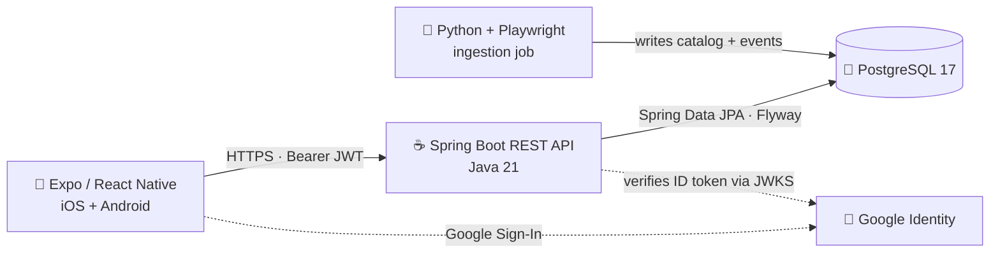
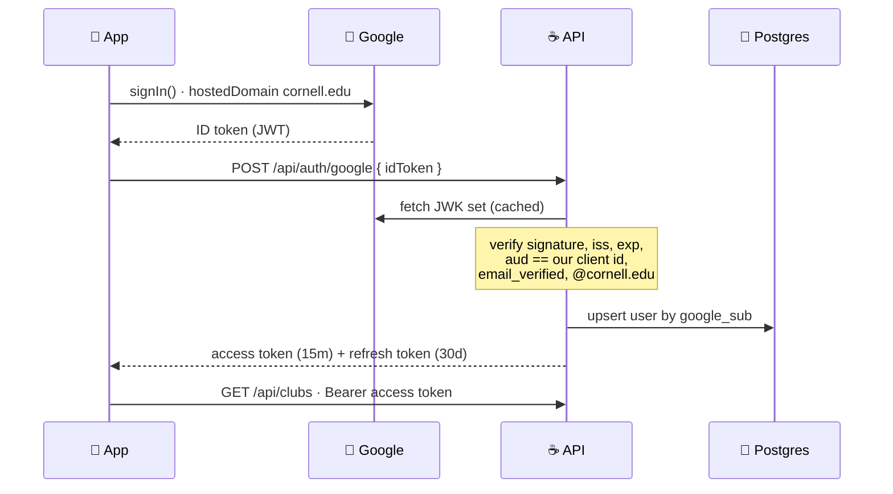

<h1 align="center">Huddle</h1>

<p align="center">
  <strong>Find your people at Cornell.</strong><br/>
  Club discovery for Cornell students: match on your interests, save the clubs you like, and never miss their next event.
</p>

<p align="center">
  
  
  
  
  
</p>

<p align="center">
  <strong>📱 Coming soon to the App Store and Google Play.</strong>
</p>

---

## Overview

Cornell has over a thousand student organizations, and finding the ones that actually fit you means 1) digging through an outdated CampusGroups directory that was not built for browsing or 2) attending an overcrowded Club Fest where you only have time to visit a handful of clubs.

Huddle turns that directory into a feed. Sign in with your Cornell Google account, pick the things you care about, and get a personalized list of genuinely active clubs, each with a real profile, live contact links, and the events they have coming up. Save the ones you like and check back for what's next.

Huddle is mobile-first and Cornell-only: sign-in is restricted to `@cornell.edu` Google accounts, so the community stays students.

## Features

- Interest-based onboarding: pick what you care about, get a feed built around it
- Ranked club feed sorted by an activity score derived from how alive a club actually is, not how long its description is
- Upcoming events per club, extracted and updated automatically from Instagram activity

## Architecture

Three independently deployable pieces share one database.



### Authentication flow

Sign-in is stateless. The app never sees a Google access token, and the API never stores a Google credential; it verifies Google's ID token offline against Google's published keys, then issues its own.



## Tech stack

| Layer | Stack |
|---|---|
| **Mobile** | Expo SDK 54 · React Native 0.81 · Expo Router 6 · TypeScript |
| **UI & state** | NativeWind (Tailwind) · React Query · Zustand · FlashList |
| **Backend** | Java 21 · Spring Boot 3.5 · Spring Security (OAuth2 Resource Server) · Spring Data JPA · Bean Validation |
| **Database** | PostgreSQL 17 · Flyway migrations · native enums, `jsonb`, generated `tsvector` full-text search |
| **Ingestion** | Python · Playwright |
| **Testing** | JUnit 5 · Mockito · Testcontainers · Jest · React Native Testing Library |
| **Infrastructure** | Docker · Railway (API + Postgres) · EAS Build / Submit / Update |

## Project structure

A pnpm workspace with the backend and mobile client side by side.

```
huddle/
├── apps/
│   ├── api/                        # Spring Boot REST API
│   │   └── src/main/
│   │       ├── java/com/huddle/
│   │       │   ├── auth/           # Google verification, token issue + rotation
│   │       │   ├── club/           # club feed, detail, entities, repositories
│   │       │   ├── event/          # club events
│   │       │   ├── interest/       # interest taxonomy
│   │       │   ├── user/           # accounts, saved clubs
│   │       │   ├── common/         # error handling, shared response envelopes
│   │       │   └── config/         # security, app configuration
│   │       └── resources/
│   │           └── db/migration/   # Flyway migrations
│   │
│   └── app/                        # Expo / React Native client
│       └── src/
│           ├── app/                # Expo Router routes (file-based)
│           ├── features/           # feature modules: clubs, auth, onboarding
│           ├── components/ui/      # shared UI primitives
│           └── lib/                # api client, auth storage, i18n, test utils
│
├── docs/                           # ERD and design docs
└── package.json                    # workspace root
```

The backend is organized package-by-feature: each feature owns its entities, repositories, services, controllers, and DTOs.

## Getting started

### Prerequisites

| Requirement | Version | Notes                                                                     |
|---|---|---------------------------------------------------------------------------|
| **JDK** | 21 | For the Spring Boot API                                                   |
| **Node.js** | LTS (20+) | For the mobile client                                                     |
| **pnpm** | 9+ | Workspace package manager                                                 |
| **PostgreSQL** | 17 | Local database                                                            |
| **Docker** | any recent | Required for backend integration tests (Testcontainers)                   |
| **Xcode / Android Studio** | latest | Native builds: Google Sign-In needs a dev build, so Expo Go will not work |

### 1. Clone and install

```bash
git clone git@github.com:nslingo/huddle.git
cd huddle
pnpm install
```

### 2. Create the database

The application user owns the schema so Flyway can run DDL without a superuser:

```sql
CREATE DATABASE huddle;
CREATE USER huddle_app WITH PASSWORD 'your-password';
GRANT ALL PRIVILEGES ON DATABASE huddle TO huddle_app;
ALTER DATABASE huddle OWNER TO huddle_app;
```

Flyway applies the schema automatically on first boot.

### 3. Configure environment

Create `apps/api/.env`:

```properties
DB_NAME=huddle
DB_USERNAME=huddle_app
DB_PASSWORD=your-password

# The Web OAuth client id from Google Cloud Console.
# The mobile app passes this same value as `webClientId`, and the API
# requires it as the `aud` claim on every incoming Google ID token.
GOOGLE_CLIENT_ID=your-client-id.apps.googleusercontent.com

# HS256 signing secret for access tokens (at least 32 bytes).
JWT_SECRET=a-long-random-secret-at-least-32-bytes
```

You will need three OAuth clients in Google Cloud Console: **Web** (the audience the API asserts), **iOS** (provides the reversed-client-id URL scheme), and **Android** (one per signing certificate SHA-1).

### 4. Run the API

```bash
cd apps/api
./mvnw spring-boot:run          # http://localhost:8080
```

> Run from the `apps/api` directory so the `.env` file resolves. From anywhere else, pass the variables through the environment instead.

### 5. Run the mobile app

Point the client at your API in `apps/app/.env`:

```properties
EXPO_PUBLIC_API_URL=http://localhost:8080
```

Then build and launch:

```bash
cd apps/app
pnpm prebuild                   # generate native projects
pnpm ios                        # or: pnpm android
```

## Usage

### API

All endpoints require a `Bearer` access token except the two that issue one.

| Method | Endpoint | Description |
|---|---|---|
| `POST` | `/api/auth/google` | Exchange a Google ID token for a Huddle token pair |
| `POST` | `/api/auth/refresh` | Rotate a refresh token into a new pair |
| `POST` | `/api/auth/logout` | Revoke the current refresh token family |
| `GET` | `/api/auth/me` | The signed-in user |
| `GET` | `/api/clubs` | Paginated club feed, ranked by activity |
| `GET` | `/api/clubs/{publicId}` | Full club profile |
| `GET` | `/api/clubs/{publicId}/events` | A club's upcoming events |
| `GET` | `/api/interests` | The full interest taxonomy |
| `PUT` | `/api/users/me/interests` | Set the signed-in user's interests |
| `GET` | `/api/users/me/saved-clubs` | Saved clubs |
| `PUT` | `/api/clubs/{publicId}/save` | Save a club |
| `DELETE` | `/api/clubs/{publicId}/save` | Unsave a club |

Errors return a consistent JSON envelope, and no endpoint leaks a stack trace:

```json
{
  "timestamp": "2026-03-14T18:22:41.913Z",
  "status": 404,
  "error": "Not Found",
  "message": "Club not found",
  "path": "/api/clubs/1e9f...c4a2"
}
```

### Tests

```bash
# Backend: unit and slice tests (no Docker required)
cd apps/api && ./mvnw test

# Backend: full suite including Testcontainers integration tests (Docker required)
cd apps/api && ./mvnw verify

# Mobile
cd apps/app && pnpm test
```

Integration tests run against a real PostgreSQL container with the actual Flyway migrations applied; schema mappings, native enums, `jsonb` round-trips, and the security filter chain are all exercised against the real thing rather than a mock.

### Common scripts

| Command | Run from | Description |
|---|---|---|
| `pnpm app:start` | repo root | Expo dev server |
| `pnpm app:ios` / `pnpm app:android` | repo root | Build and launch on a simulator or device |
| `pnpm type-check` | `apps/app` | TypeScript validation |
| `pnpm lint` | `apps/app` | ESLint |
| `./mvnw verify` | `apps/api` | Full backend build and test |

## Deployment

**API**: packaged as a Docker image and deployed to Railway, alongside a managed PostgreSQL instance. Flyway migrations run on startup, so a deploy and a schema change are the same operation.

**Mobile**: built and signed with EAS Build, submitted to both stores through EAS Submit.

**Ingestion**: the scraper runs as a scheduled offline job, writing directly to the same database.

## Roadmap

- Push notifications for events from saved clubs
- Friend activity: see which clubs the people you know are in
- Club-officer accounts for managing profiles and posting events directly
- Semester-over-semester activity trends
- Expansion beyond Cornell

## Acknowledgements

The mobile client was scaffolded from the [Obytes React Native starter](https://starter.obytes.com), which is MIT licensed.

Club information is sourced from publicly listed Cornell student organization data. Huddle is an independent project and is not affiliated with, endorsed by, or sponsored by Cornell University.

## License

Licensed under the Apache License 2.0. See [LICENSE](LICENSE) for details.

## Contact

**Noah Lingo**: [noahswlingo@gmail.com](mailto:noahswlingo@gmail.com)